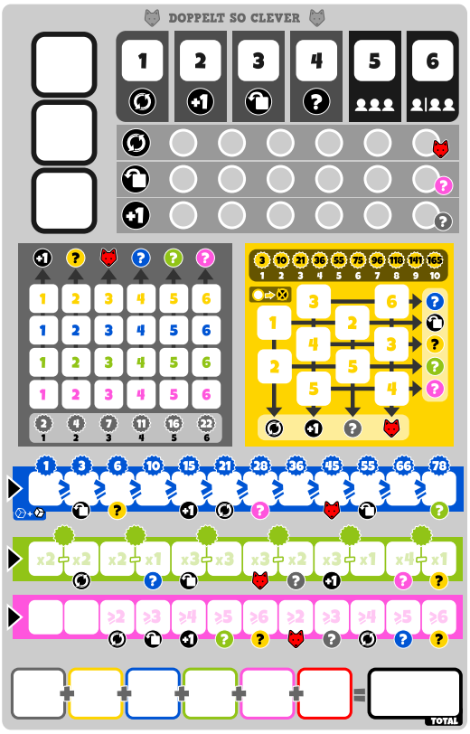

# TwiceAsClever

A web-based score sheet generator for the board game **Twice as Clever** (Doppelt So Clever).

**[Play Now on GitHub Pages](https://lindz0.github.io/TwiceAsClever/)**



---

## About

This tool generates randomized score sheets for the popular roll-and-write board game **Twice as Clever**. Numbers and icons are shuffled each session so no two games feel the same.

Each sheet is generated using a **seed string**, making results fully reproducible — share a seed with friends to play the exact same sheet.

---

## Versions

| Version | Challenges | Dice | Sheets | Description |
|---------|-----------|------|--------|-------------|
| [Version 1](twiceasclever.html) | Challenge 1 | T6 | Single | Original single score sheet |
| [Version 2](twiceasclever2.html) | Challenge 1 | T6 | Dual | Two sheets side-by-side with editable seed |
| [Version 3](twiceasclever3.html) | Challenge 3 | T6 | Dual | Challenge 3 layout with icons |
| [Version 4](twiceasclever4.html) | Challenge 3 | T8 | Dual | Advanced version with T8 dice and extra icons |

---

## How to Use

1. Visit the **[GitHub Pages site](https://lindz0.github.io/TwiceAsClever/)**
2. Select a version
3. Optionally type a **seed string** in the input field to get a reproducible sheet
4. Print the page and play!

> **Tip:** Leave the seed empty for a fresh random sheet each time, or use a shared seed (e.g. `GameNight2025`) so all players get identical sheets.

---

## How It Works

- Sheets are rendered onto an HTML5 `<canvas>` element overlaid on a background image
- Randomization uses [seedrandom.js](https://github.com/davidbau/seedrandom) for deterministic, seed-based number generation
- Numbers and icons are shuffled independently per color section (grey, blue, green, pink, yellow)

---

## Project Structure

```
index.html               – Landing page with links to all versions
twiceasclever.html       – Version 1: Challenge 1, T6, single sheet
twiceasclever2.html      – Version 2: Challenge 1, T6, dual sheet
twiceasclever3.html      – Version 3: Challenge 3, T6, dual sheet with icons
twiceasclever4.html      – Version 4: Challenge 3, T8, dual sheet with icons
seedrandom.js            – Seeded random number library
TwiceAsCleverChallenge1.png  – Background image for Challenge 1 sheets
TwiceAsCleverChallenge3.png  – Background image for Challenge 3 sheets
Icons.png                – Icon sprite sheet used by Challenge 3 versions
```
